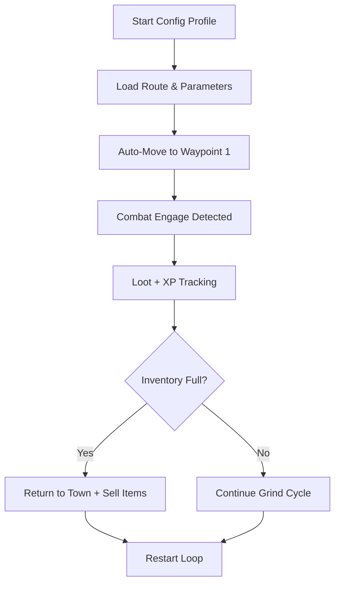

# Black Desert Auto-Grind Config ⚙️

The **Black Desert Auto-Grind Config Tool** is a next-generation automation companion designed to make your grind sessions efficient, predictable, and loot-rich. Built with adaptive logic and customizable loops, it lets players configure automated combat, item collection, and return routes — perfectly balanced for uninterrupted XP gain.

Whether you’re farming in Valencia, Elvia Realms, or the Forest of Seclusion, this config-based system helps you manage time, inventory, and performance like a true min-maxer.

---

## 🧠 Overview

The **Auto-Grind Config System** operates through a modular task loop that reads your desired grind area, timing, and behavior values. Using real-time telemetry, it adjusts movements, attacks, and item pickups according to monster density and loot weight.

You can fine-tune **speed**, **route length**, **combat aggression**, and **return intervals** — giving you total control over how long you grind and how you recover.

[!NOTE]
This configuration system is external and user-controlled. It’s designed for **optimization**, not server manipulation or illegal modification.

---

## ⚙️ Main Features

* **Waypoint Loop Builder:** Map grind paths through coordinates or mini-map clicks.
* **Mob Density Tracker:** Calculates spawn concentration to reroute efficiently.
* **Auto-Heal & Buff Logic:** Activates potions and buffs automatically at custom thresholds.
* **Inventory & Weight Monitor:** Detects near-capacity loads and triggers return-to-town actions.
* **Loot Filter Integration:** Ignore trash loot or prioritize rare drops like Caphras and Scrolls.
* **Adaptive AI Mode:** Learns attack frequency and rotation timing from your playstyle.
* **Multi-Profile Config:** Swap between grind presets instantly with hotkeys.

---

## 💻 Compatibility Table

| Platform             | Status | Notes                                    |
| -------------------- | ------ | ---------------------------------------- |
| Windows 10           | ✅      | Stable performance, full overlay support |
| Windows 11           | ✅      | Optimized memory management              |
| Steam Version        | ✅      | Compatible with direct overlay           |
| Pearl Abyss Launcher | ✅      | Works with standard injection mode       |
| Controller Input     | ⚙️     | Requires custom keymapping               |

[!IMPORTANT]
Always run as Administrator and disable **fullscreen optimizations** for smoother automation cycles.

---

## 🛠 Setup Guide

1. **Unpack** the downloaded archive to your documents folder.
2. Run the `GrindConfig.exe` file.
3. Open the in-game map and record your path using the hotkey `Ctrl + R`.
4. Save your loop under a custom profile name:

   ```bash
   /config save desert_loop --interval 3.2 --return 45 --loot rare_only
   ```
5. Launch your Black Desert session, then press `Insert` to activate the Auto-Grind UI.
6. Choose your loop profile and press **Start Cycle**.
7. Monitor stats or pause the loop anytime with `F8`.

---

## 🔁 Flowchart: How It Works



---

## 🧩 Example Config (JSON)

```json
{
  "profile": "valencia_loop_A",
  "waypoints": [
    {"x": 3502, "y": 1245},
    {"x": 3568, "y": 1201},
    {"x": 3630, "y": 1180}
  ],
  "combat": {"aggression": 0.85, "reactionDelay": 0.18},
  "loot": {"filter": ["Caphras Stone", "Scroll Fragment"], "ignoreCommon": true},
  "returnToTown": {"weightLimit": 90, "interval": 45, "autoSell": true},
  "aiMode": "adaptive",
  "loopDelay": 3.2
}
```

---

## ❓ FAQ

**Q1: Can I use multiple grind routes?**
A: Yes. You can define multiple profiles and switch between them via `F5` or the overlay dropdown.

**Q2: What’s the best interval for grinding?**
A: For balanced CPU performance, keep `loopDelay` between **2.5–3.5 seconds** depending on monster density.

**Q3: Does this support water or ocean routes?**
A: Not yet. Auto-grind currently supports **land-based loops** only.

**Q4: Can I pause the auto-grind when a GM appears?**
A: The AI includes **environmental awareness** triggers that can auto-stop when unusual proximity is detected.

**Q5: How often are configs updated?**
A: Weekly syncs push compatibility fixes and new region presets for newer grind zones.

---

## 💡 Pro Configuration Tips

* Set **weight limit** at 85–90% to avoid missed loot pickups.
* Keep **AI aggression** under 0.9 for smoother animation alignment.
* Use **auto-heal threshold at 60% HP** for safe long grinds.
* Save separate loops for *Valencia Desert*, *Star’s End*, and *Elvia Orc Camp*.
* Combine radar filters to highlight elite spawns during grinding.

---

## 🔚 Final Thoughts

The **Black Desert Auto-Grind Config Tool** merges efficiency with smart automation. You decide how, where, and when your character grinds — optimizing every second of playtime while preserving full control. With its modular presets, advanced route logic, and adaptive timing system, this is the future of intelligent farming in Black Desert.

---

**Streamline your grind — master automation with Black Desert Auto-Grind Config today.**
